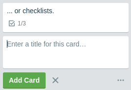
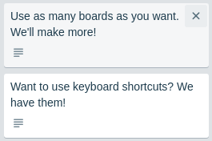
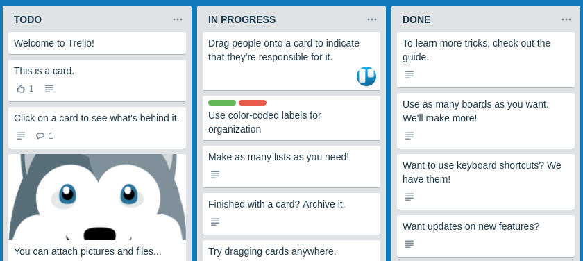

https://ajoq.github.io/js-kanban/

### Kanban

Пример [Trello](https://trello.com):

#### Описание

Доска, состоящая из колонок, в каждой колонке может быть несколько карточек.

1. Кол-во колонок фиксировано и равно 3
1. Новые колонки добавлять нельзя, удалять имеющиеся тоже
1. Перемещать колонки тоже нельзя

Можно:
1. Добавлять карточки с помощью кнопки 'Add another card':

2. Удалять карточки - при наведении на карточку появляется иконка крестик, которая и удаляет карточку:

 
3. Перемещать карточки как внутри колонки, так и между колонками

Дополнительно:
1. Хранение состояния в LocalStorage
1. Возможность хранить текст (картинки, списки, цветовое оформление элементов не нужно)

##### Процесс перемещения

1. Внешний вид до переноса (карточка находится на своём месте):

2. Внешний вид в момент переноса (карточка удаляется из своего начального положения):

Нюансы:
1. Внешний вид курсора
2. Курсор по отношению к карточке остаётся там, где изначально схватили - не привязывается ни к левому краю, ни к центру, а там, где схватили карточку, т.е. можно схватить за нижний левый угол:

3. При наведении на другие позиции под карточку выделяется место по высоте равное размеру самой карточке, при это будет карточка ставится "до" или "после" элемента определяется исключительно позицией курсора:

